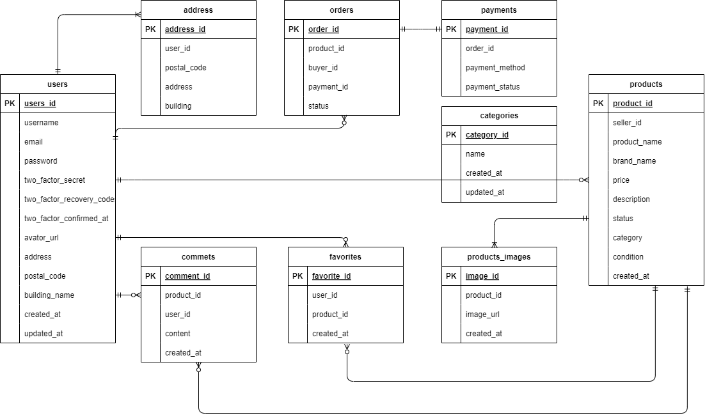

# 新フリマアプリ

## 環境構築

**Docker ビルド**

1. git clone git@github.com:差し替えます
2. DockerDesktop アプリを立ち上げる
3. `docker-compose up -d --build`

> _Mac の M1・M2 チップの PC の場合、`no matching manifest for linux/arm64/v8 in the manifest list entries`のメッセージが表示されビルドができないことがあります。
> エラーが発生する場合は、docker-compose.yml ファイルの「mysql」内に「platform」の項目を追加で記載してください_

```bash
mysql:
    platform: linux/x86_64(この文追加)
    image: mysql:8.0.26
    environment:
```

**画像アップロード用ディレクトリの作成（初回のみ）**

画像保存用のディレクトリが存在しないと、出品画像やプロフィール画像が正しく保存されません。
以下のディレクトリを手動で作成してください。

1. `mkdir -p storage/app/public/products`<br>
2. `mkdir -p storage/app/public/profile_images`<br>

**Laravel 環境構築**

1. `docker-compose exec php bash`
2. `composer install`
3. 「.env.example」ファイルを 「.env」ファイルに命名を変更。または、新しく.env ファイルを作成
4. .env に以下の環境変数を追加

```text
DB_CONNECTION=mysql
DB_HOST=mysql
DB_PORT=3306
DB_DATABASE=laravel_db
DB_USERNAME=laravel_user
DB_PASSWORD=laravel_pass

MAIL_MAILER=smtp
MAIL_HOST=mailhog
MAIL_PORT=1025
MAIL_USERNAME=null
MAIL_PASSWORD=null
MAIL_ENCRYPTION=null
MAIL_FROM_ADDRESS=example@example.com
MAIL_FROM_NAME="COACHTECH新フリマ"

STRIPE_SECRET_KEY=sk_test_XXXXXXXXXXXXXXXXXXXXXXXX
STRIPE_PUBLIC_KEY=pk_test_XXXXXXXXXXXXXXXXXXXXXXXX

SESSION_DOMAIN=localhost
```

5. アプリケーションキーの作成

```bash
php artisan key:generate
```

6. マイグレーションの実行

```bash
php artisan migrate
```

7. シーディングの実行

```bash
php artisan db:seed
```

8. シンボリックリンク作成

```bash
php artisan storage:link
```

## 使用技術(実行環境)

- PHP8.3.0
- Laravel8.83.27
- MySQL8.0.26
- Docker / docker-compose
- Stripe（クレジット/コンビニ決済）
- Mailhog（開発用メールサーバ）

## ER 図



## URL

- 開発環境：http://localhost/
- Mailhog： http://localhost:8025
- phpMyAdmin:：http://localhost:8080/
